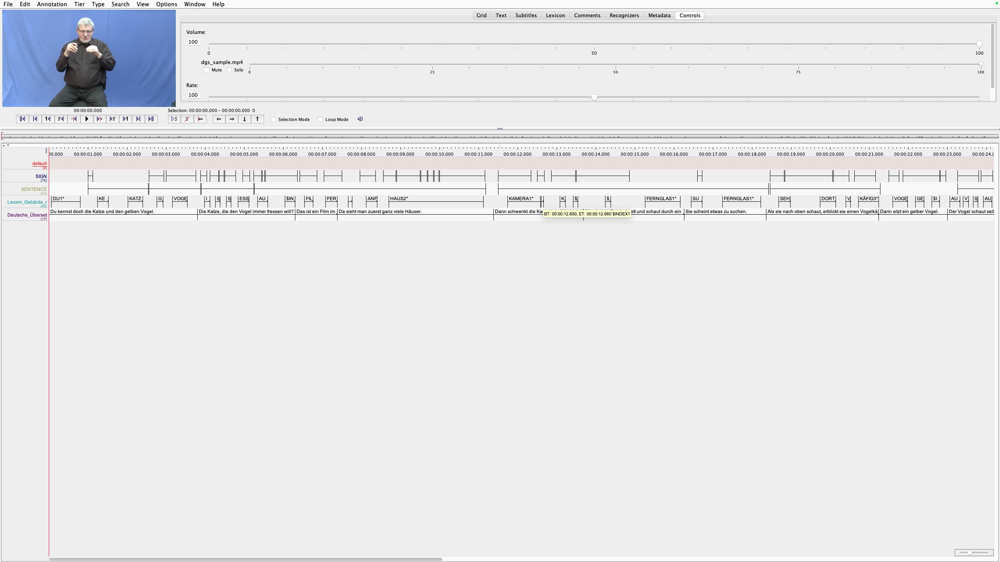

DGS DOI: doi.org/10.25592/dgs.corpus-3.0-text-1984189 OR

https://www.sign-lang.uni-hamburg.de/meinedgs/html/1984189_de.html

## Segmentation Evaluation Results

### Sign-level

| Metric | Value |
|---|---|
| Gold tier | `Lexem_Gebärde_r_B` |
| Pred tier | `SIGN` |
| Gold segments | 62 |
| Pred segments | 75 |
| Frame-level macro F1 (B/I/O) | 0.3909 |
| IoU | 0.5000 |

### Sentence-level

| Metric | Value |
|---|---|
| Gold tier | `Deutsche_Übersetzung_B` |
| Pred tier | `SENTENCE` |
| Gold segments | 17 |
| Pred segments | 15 |
| Frame-level macro F1 (B/I/O) | 0.2849 |
| IoU | 0.7650 |

Ran as:
```
wget -O dgs_sample.pose https://datasets.sigma-sign-language.com/poses/holistic/dgs_corpus/1984189_b.pose
wget -O dgs_sample.mp4 https://www.sign-lang.uni-hamburg.de/meinedgs/videos/1984189/1984189_1b1.mp4
pose_to_segments --pose="dgs_sample.pose" --elan="output.eaf" --video="dgs_sample.mp4"
python stats.py --gold_eaf gold_label.eaf --pred_eaf output.eaf --gold-tier "Lexem_Gebärde_r_B" --pred-tier SIGN
python stats.py --gold_eaf gold_label.eaf --pred_eaf output.eaf --gold-tier "Deutsche_Übersetzung_B" --pred-tier SENTENCE
```
I didn't include any testing in order to keep this short, I hope that's okay.

Visualizing results:

The output of running stats.py includes a new ELAN file, which shows both the predicted and gold labels:




Comments:
    
On the sign level, the F1 score dropped by a lot. Compared also to the previous model I ran this on, there is much more oversegmentation (prev. 66 compared to now 75). IoU also dropped rather hard (prev. 0.71 to now 0.5). Overall, the model still oversegments quite drastically.
    
The sentence level actually worked this time and showed an F1 score and IoU even worse than on a sign level. However, in the gold label sentence tier, the sentences are lined up without any breaks in between (likely to represent the continuous flow of signing better?). This would artifically lower both evaluation metrics for the model's predicted sentences, since the model does not predict sentences as perfectly lined up. I am also a little surprised by the sentences being undersegmented, since it didn't seem like this occurred in the results of the paper.

